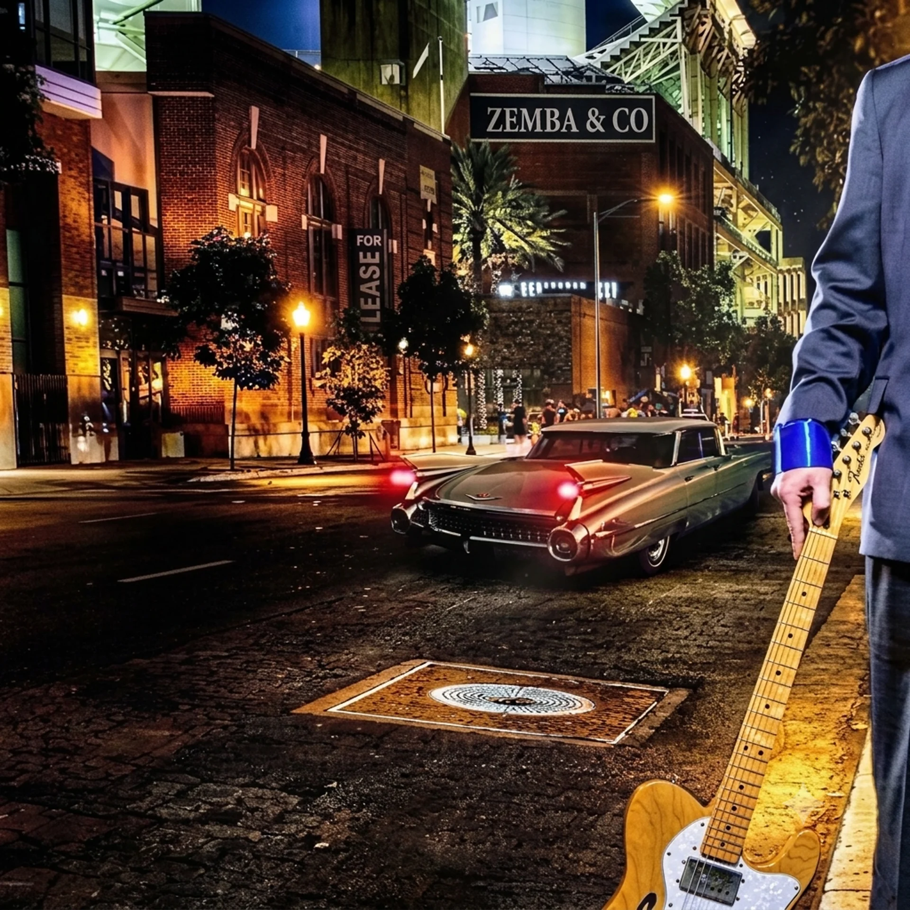

# Chris Zemba EPK — Design & Conversion Audit
**Reviewed:** `chriszemba-EPK.html` (882 lines, Tailwind CDN, single-file)
**Lens:** premium private-event + venue talent buyer, mobile-first, 30-second skim

---

## 0. Verdict up front

**Your content is already top-decile.** Real press (Review-Journal byline, Sun galleries, FOX5), named properties (Caesars / Boyd / Stations / Primm), on-property flyers as evidence, a published input list and stage plot, and W-9/COI language. Most working musicians never get past "here's my Instagram." You are not losing bookings because of your content.

**You are losing them on four things, in this order:**

| # | Failure | Cost |
|---|---|---|
| 1 | **No booking form.** `mailto:` is your only conversion path. | Highest. Corporate machines frequently have no mail client bound to `mailto:`. The click does nothing and the lead evaporates silently. |
| 2 | **Page weight.** Tailwind CDN JIT compiler + 6 live iframes on first paint. | High. A buyer on venue Wi-Fi sees an unstyled flash, then a stall. "Slow" reads as "amateur" before a single word is processed. |
| 3 | **Uniform hierarchy.** Ten sections, one rhythm. | Medium-high. Nothing is emphasized, so nothing is remembered. The eye has no path. |
| 4 | **Premium-signal leaks.** `github.io` URL, `gmail.com` address, a 413 area code on a Las Vegas act. | Medium. Individually trivial, cumulatively they cap your perceived rate. | 

Subsequently, the domain name “zembamusicco.com“ has been purchased by the User and the following domain e-mail address’s have been qued for creation [admin@zembamusicco.com and booking@zembamusicco.com ] a phone number local to the Las Vegas area 702 area code is being arranged therefore, a placeholder should just be noted until that can be officially added to the site

Everything below is ordered by revenue impact, not by how interesting it is to build.

---

## 1. Industry non-negotiables — scored against your page

Two distinct audiences read this page and they want different things. Festival/label EPK advice does not fully apply to you; your money is in the private-event and venue lane.

### Tier 1 — cost you the booking if missing

| Requirement | Status | Note |
|---|---|---|
| One-line positioning above the fold | ✅ | "Guitarist · Vocalist · Bandleader" + the 25-year line. Clean. |
| Live performance video, real stage | ✅✅ | Five reels. This is your strongest asset. Buyers weight one good live video above everything written. |
| Named press with working links | ✅✅ | RJ byline + Sun galleries + FOX5. Rare and verifiable. |
| Named venues / properties | ✅✅ | Marquee strip + on-property flyers. The flyers are the best idea on the page — third-party evidence, not self-report. |
| Tech rider + stage plot + input list | ✅✅ | Almost nobody at your tier publishes this. Keep it prominent. |
| Insurance / W-9 / COI | ✅✅ | Corporate venues typically require GL coverage; leading with it removes the planner's biggest unknown. |
| **Working contact path that captures a lead** | ❌ | `mailto:` + `tel:` only. **P0.** |
| **Mobile performance** | ❌ | See §5. **P0.** |
| Short + long bio in third person, paste-ready | ⚠️ | You have the long version. Missing a 50–80 word block a venue can paste into their event listing without editing. |

### Tier 2 — separates "considered" from "shortlisted"

| Requirement | Status | Note |
|---|---|---|
| **Upcoming / recent dates** | ❌ | You say "Now booking 2026 & 2027" and then show zero dates. A buyer's instinct is to come watch you. Give them a date. **This is your biggest content gap.** |
| **Investment signal** | ❌ | Zero pricing anywhere. A planner screening six acts against a budget line drops the one they can't triage. See the red-team pushback in §7 — this is nuanced. |
| **Downloadable one-sheet PDF** | ❌ | Web EPKs are correct for first contact, but internally a planner forwards a PDF to a committee. Give them one page: photo, bio, three quotes, formats, contact. |
| Named testimonials with role + org | ⚠️ | Two, one of which is "Barnett Wedding Party." Get three named: a catering/banquet manager, a wedding planner, an entertainment director. Title + property. |
| High-res photo pack, horizontal + vertical crops | ⚠️ | The `.zip` exists but is unlabeled and unexplained. Press layouts need both orientations. Say what's inside. |
| Custom domain + branded email | ❌ | `quantumq1981.github.io` is in your Open Graph URL. Every share preview shows it. |
| Structured data (JSON-LD) | ❌ | Free SEO + AI-search visibility. 20 lines. |
| CTA analytics | ❌ | You currently cannot tell whether buyers download the rider. |

### Tier 3 — polish that compounds

Visible keyboard focus · print stylesheet · reduced-motion respected · art-directed mobile crops · "how booking works" 3-step · video testimonial.

---

## 2. Visual Hierarchy & Spacing

### The core diagnosis: **rhythmic monotony**

Every section from `#events` to `#reviews` is structurally identical:

```
py-16 md:py-20  →  max-w-2xl mb-9  →  eyebrow  →  h2  →  neon-rule w-40  →  paragraph
```

Ten times. Repetition this exact stops reading as "systematic" and starts reading as "template." A press kit should have a **crescendo** — hero, build, proof spike, close.

---

### Fix 2.1 — Three-tier vertical scale

Replace the flat `py-16 md:py-20` with tiers that encode importance.

```html
<!-- TIER 1 — Hero + Booking CTA. These get room to breathe. -->
class="py-24 md:py-36 lg:py-44"

<!-- TIER 2 — Load-bearing: #events, #acts, #stage, #about -->
class="py-20 md:py-28"

<!-- TIER 3 — Support: #billing, #press, #songs, #specs, #reviews -->
class="py-14 md:py-20"
```

Do not skip this. The differential is what creates hierarchy — uniform generous spacing reads exactly the same as uniform tight spacing.

---

### Fix 2.2 — The sticky-nav anchor bug *(real defect, not taste)*

Your nav is `sticky top-0` at `h-14` (56px). Every in-page anchor jump parks the section heading **underneath** it. Add to all ten sections:

```html
<section id="events" class="scroll-mt-24 py-20 md:py-28">
```

And guard smooth scroll for reduced-motion users:

```css
@media (prefers-reduced-motion: no-preference) { html { scroll-behavior: smooth; } }
```

*(Currently `scroll-behavior: smooth` is unconditional in your `<style>` block.)*

---

### Fix 2.3 — Break the section-header pattern

Right now heading and deck stack in a 672px column, leaving half the width empty on desktop. Split them:

```html
<div class="grid lg:grid-cols-12 gap-6 lg:gap-12 items-end mb-12 md:mb-16">
  <div class="lg:col-span-7">
    <p class="eyebrow text-[11px] font-display font-600 uppercase text-fire-400 mb-3">Right act, right room</p>
    <h2 class="font-display font-700 uppercase text-balance
               text-[clamp(1.875rem,1.1rem+3.4vw,3.5rem)]
               leading-[0.95] tracking-[-0.01em]">
      Built for the event <span class="text-fire-grad">you are producing</span>
    </h2>
  </div>
  <p class="lg:col-span-5 text-slate-300 text-[15px] md:text-base leading-[1.7] lg:pb-1">
    One bandleader, one point of contact, and a lineup that scales from a solo acoustic
    ceremony to a five-piece show.
  </p>
</div>
```

**And delete `<hr class="neon-rule">` from eight of the ten sections.** A signature device used everywhere is wallpaper. Keep it in the hero region and the booking CTA only.

---

### Fix 2.4 — Container width

`max-w-6xl` (1152px) wraps the entire `<main>`, including the photo bento and the On Stage gallery. On a 1440px+ display — which is what a talent buyer at a desk is using — a cinematic gallery boxed to 1152px looks like a phone site that got stretched.

Add one escape-hatch utility to your `<style>` block:

```css
/* Lets a child of a max-w container break to near-viewport width, safely. */
.bleed-wide {
  margin-inline: calc(50% - 50vw);
  padding-inline: max(1.25rem, calc(50vw - 44rem));
}
@media (max-width: 767px) { .bleed-wide { margin-inline: 0; padding-inline: 0; } }
```

Apply to the **On Stage gallery grid** and the **venue marquee** only. Two moments of width beat ten.

---

### Fix 2.5 — Card padding proportional to card size

Your bento tiles all use `p-6` regardless of whether the tile is 168px or 400px tall. Scale it:

- Small tiles (Casino, Private Parties): `p-5 md:p-6`
- Wide tiles (Corporate, Festivals): `p-6 md:p-8`
- Feature tile (Weddings, photo-backed): `p-6 md:p-9`
- Grid gaps: `gap-4 md:gap-5`

---

## 3. Typography & Readability

### What's working
Anton for the name, Oswald for section heads, Inter for body is a legitimate Vegas-marquee stack. `leading-[0.92]` on the Anton H1 is correct — display faces need negative-ish leading. Don't throw this out.

### Six problems

---

**3.1 — No fluid scale.** `text-3xl md:text-5xl` jumps 30px → 48px at exactly 768px and then never grows again. Your headings are the same size on an iPad and a 27" monitor.

```html
<!-- H1 -->
class="font-heavy uppercase text-white text-balance
       text-[clamp(3rem,1.4rem+7vw,7rem)] leading-[0.88] tracking-[-0.02em]"

<!-- H2 -->
class="font-display font-700 uppercase text-balance
       text-[clamp(1.875rem,1.1rem+3.4vw,3.5rem)] leading-[0.95] tracking-[-0.01em]"

<!-- H3 -->
class="font-display font-600 uppercase text-xl md:text-2xl tracking-[0.01em]"
```

---

**3.2 — `tracking-tight` on uppercase Oswald is wrong at small sizes.** Capitals need *more* sidebearing than lowercase, not less. At `text-3xl` on mobile your H2s collide. Use `tracking-[-0.01em]` at display sizes and let it go to normal below `text-4xl` — the `clamp()` above plus `-0.01em` handles both ends.

---

**3.3 — Your value propositions are set as fine print.** Nearly every card body is `text-sm text-slate-400`. That's 14px at 7.24:1 on `midnight-850`. Legible, but it *reads* as a footnote — and these lines are the actual sales copy ("W-9 and certificate of insurance handled before you ask" is a closing argument, not a caption).

```html
<!-- Promote all card body copy -->
class="text-[15px] text-slate-300 mt-2 leading-[1.6]"
```

Reserve `text-sm text-slate-400` for genuine metadata: figcaptions, table cells, the artist-rotation list.

---

**3.4 — Measure is too long.** `max-w-2xl` at `text-base` runs 85–95 characters. The comfortable range is 60–75.

```html
<p class="max-w-[62ch] text-slate-300 leading-[1.7]">
```

---

**3.5 — Your proof stats are underplayed.** `25+`, `8+`, `160`, `FOX5` are the four numbers a buyer repeats to their boss, and they're set at `text-3xl` in equal boxes. Make them a moment:

```html
<div class="grid grid-cols-2 lg:grid-cols-4 gap-px bg-white/[0.07] rounded-2xl overflow-hidden
            shadow-[inset_0_1px_0_0_rgba(255,255,255,0.07)]">
  <div class="bg-midnight-900 px-5 py-8 md:py-10 text-center">
    <p class="font-heavy tabular-nums text-fire-grad leading-none
              text-[clamp(2.5rem,1.5rem+3.5vw,4.25rem)]">25<span class="text-[0.6em] align-super">+</span></p>
    <p class="text-[11px] text-slate-400 uppercase tracking-[0.18em] mt-3 font-display font-500">Years live</p>
  </div>
  <!-- repeat -->
</div>
```

The `gap-px` over a light background gives you hairline dividers instead of four floating boxes — tighter, more editorial, more expensive-looking.

---

**3.6 — `.eyebrow { letter-spacing: .32em }` is too wide.** At 11px, 0.32em fragments the word into letters. Drop to `.20em`.

---

**Tech debt worth naming:** you overrode `fontWeight` with numeric keys (`font-500`, `font-600`). It works under the CDN, but it's non-standard and will break silently the day you move to a build step or Tailwind v4. Map to `font-medium` / `font-semibold` / `font-bold` when you refactor.

---

## 4. Color & Contrast

### Palette verdict: **keep it.** 

Midnight → fire → azure derived from your own logo tubes is the right instinct and it's genuinely cinematic. The hues are not the problem.

---

### 4.1 — Measured contrast failures

I computed WCAG ratios across your actual token values:

| Foreground | on `midnight-950` | on `midnight-900` | on `midnight-850` | Verdict |
|---|---|---|---|---|
| `slate-100` | 18.48 | 17.70 | 16.94 | ✅ |
| `slate-300` | 13.64 | 13.06 | 12.50 | ✅ |
| `slate-400` | 7.90 | 7.56 | 7.24 | ✅ |
| **`slate-500`** | **4.26** | **4.08** | **3.90** | ❌ **fails AA (4.5 required)** |
| **`slate-600`** | **2.67** | **2.56** | **2.45** | ❌ **hard fail** |
| `fire-400` | 7.81 | 7.48 | 7.16 | ✅ |
| `fire-500` | 5.90 | 5.65 | 5.41 | ✅ |
| `azure-300` | 9.89 | 9.47 | 9.06 | ✅ |

**`slate-500` currently carries:** the entire venue marquee, table headers, several `text-[11px]` labels, the "sample of artists in rotation" heading.
**`slate-600` currently carries:** footer copyright, the Venmo link, external-link icons.

**Rule to adopt:** `slate-400` is the floor for anything a human reads. `slate-500` is for decoration only. Delete `slate-600` from the file.

The marquee fix matters most — moving text at 3.90:1 is effectively unreadable, and that strip is your credibility list:

```html
<div class="marquee-track gap-10 text-slate-300/90 font-display font-500 uppercase
            tracking-[0.15em] text-sm md:text-base whitespace-nowrap">
```

---

### 4.2 — Accent inflation *(the highest-leverage color note)*

Count your `fire-400` / `fire-500` usages: eyebrows, every icon, every chip, list bullets, gradient text, hover borders, buttons, glows, marquee dots. That's ~40 fire elements per screen. **When the accent is everywhere, your CTA button is not special.**

Adopt a three-level accent budget:

| Level | Treatment | Allowed on |
|---|---|---|
| **1** | Solid `bg-fire-500` fill | Primary CTA only. **Max one per viewport.** |
| **2** | `text-fire-400` | Eyebrows, and the one gradient word per heading |
| **3** | `bg-fire-500/10` + `border-fire-500/20` | Chips, icon tiles |

**Concretely:** demote decorative icons from `text-fire-400` to `text-slate-500`, and let them ignite on hover. One find/replace, immediate lift:

```html
<!-- before -->
<i class="fa-solid fa-dice text-fire-400 text-lg"></i>

<!-- after — quiet by default, warms on card hover -->
<i class="fa-solid fa-dice text-slate-400 text-lg transition-colors duration-300 group-hover:text-fire-400"></i>
```

Same logic for `glow-fire`: it's on the brand banner, three video frames, the Primm flyer, the About photo, the hero CTA, the nav button. Cut it to **two placements per page.**

---

### 4.3 — Surfaces are flat

Every card is `bg-midnight-850` or `bg-midnight-900` with `border-white/10`. That's paint. Premium dark UI has **edge light**. Three cheap upgrades, in order of ROI:

**a) Inset top highlight** — the single best-value trick in dark design. One line, works on every card:

```html
class="... shadow-[inset_0_1px_0_0_rgba(255,255,255,0.07)]"
```

**b) Gradient surface instead of flat fill:**

```html
<!-- before -->
class="bg-midnight-850 border border-white/10"

<!-- after — reads as glass over the page, not as a painted rectangle -->
class="bg-gradient-to-b from-white/[0.055] to-white/[0.012] border border-white/[0.09]
       shadow-[inset_0_1px_0_0_rgba(255,255,255,0.07)]"
```

**c) Move glow from cards to sections.** One large ambient radial per section beats six card glows:

```html
<section class="relative isolate scroll-mt-24 py-20 md:py-28">
  <div aria-hidden="true"
       class="pointer-events-none absolute -z-10 left-1/2 -top-24 h-[480px] w-[900px]
              -translate-x-1/2 rounded-full bg-fire-500/[0.07] blur-[120px]"></div>
  ...
</section>
```

---

### 4.4 — Upgrade the nav glass

`backdrop-blur-md` at `bg-midnight-950/80` is muddy. The thing that makes glass look expensive is **saturation boost**:

```html
<nav class="sticky top-0 z-50 border-b border-white/[0.06]
            bg-midnight-950/85 backdrop-blur-xl backdrop-saturate-150
            supports-[backdrop-filter]:bg-midnight-950/60
            transition-colors duration-300">
```

Optional but worth it — let the nav start transparent over the hero and solidify on scroll:

```html
<script>
  const nav = document.querySelector('nav');
  const onScroll = () => nav.classList.toggle('bg-midnight-950/85', window.scrollY > 40);
  addEventListener('scroll', onScroll, { passive: true }); onScroll();
</script>
```

---

## 5. Interactive Elements & Components

### 5.1 — **You have no visible focus states.** *(a11y defect + polish gap)*

Not one `focus-visible:` anywhere in 882 lines. Keyboard users get the browser default, which on `#04060d` is close to invisible. Add globally:

```css
:where(a, button, [tabindex], summary, input, select, textarea):focus-visible {
  outline: 2px solid #ff9d5f;
  outline-offset: 3px;
  border-radius: 8px;
}
:where(a, button):focus:not(:focus-visible) { outline: none; }
```

---

### 5.2 — Elevate `.card-hover`

Current: `translateY(-4px)` and nothing else. Coordinate the whole card and respect reduced motion:

```css
.card-hover {
  transition: transform .4s cubic-bezier(.22,1,.36,1),
              box-shadow .4s cubic-bezier(.22,1,.36,1),
              border-color .3s ease;
  will-change: transform;
}
.card-hover:hover {
  transform: translateY(-6px);
  box-shadow: 0 28px 60px -28px rgba(0,0,0,.95),
              inset 0 1px 0 0 rgba(255,255,255,.11);
}
@media (prefers-reduced-motion: reduce) {
  .card-hover, .card-hover:hover { transform: none; transition: none; }
  .group:hover img { transform: none !important; }
}
```

*(Your marquee already respects reduced-motion. The `group-hover:scale-105` on eight gallery images does not.)*

---

### 5.3 — Primary CTA: give it weight, press feedback, and a sweep

```html
<a href="#book"
   class="group relative inline-flex items-center gap-2.5 overflow-hidden rounded-xl
          bg-gradient-to-b from-fire-400 to-fire-600 text-midnight-950
          font-display font-700 uppercase tracking-wider text-sm px-8 py-4
          shadow-[0_10px_30px_-10px_rgba(238,90,32,.65),inset_0_1px_0_0_rgba(255,255,255,.35)]
          transition-[transform,box-shadow] duration-200
          hover:-translate-y-0.5
          hover:shadow-[0_18px_44px_-12px_rgba(238,90,32,.85),inset_0_1px_0_0_rgba(255,255,255,.45)]
          active:translate-y-0 active:shadow-[0_6px_18px_-8px_rgba(238,90,32,.6)]
          focus-visible:outline-fire-300">
  <i class="fa-solid fa-calendar-check"></i>
  <span>Check your date</span>
  <span aria-hidden="true"
        class="pointer-events-none absolute inset-0 -translate-x-full
               bg-gradient-to-r from-transparent via-white/25 to-transparent
               transition-transform duration-700 group-hover:translate-x-full"></span>
</a>
```

Secondary button, matched:

```html
<a class="inline-flex items-center gap-2.5 rounded-xl px-8 py-4
          font-display font-600 uppercase tracking-wider text-sm text-white
          bg-white/[0.05] border border-white/[0.14]
          shadow-[inset_0_1px_0_0_rgba(255,255,255,0.07)]
          transition-[transform,background-color,border-color] duration-200
          hover:bg-white/[0.09] hover:border-white/25 hover:-translate-y-0.5 active:translate-y-0">
```

Copy note: **"Check Availability" → "Check your date."** Name the thing the buyer controls, not the thing your system does.

---

### 5.4 — Kill the six live iframes *(biggest measurable performance win)*

Five YouTube embeds + one SoundCloud player load on first paint, including the two hidden tab panels — `hidden` does not stop an iframe from fetching. That's roughly 1.5–3 MB and 200+ requests before a buyer reads a word.

Replace with click-to-load facades:

```html
<div class="yt aspect-video w-full rounded-xl overflow-hidden bg-midnight-900
            border border-white/10 relative group cursor-pointer"
     data-id="TVp9LDZ0g_M"
     role="button" tabindex="0"
     aria-label="Play: The Chris Zemba Band Promo Reel 2026">
  
  <div class="absolute inset-0 bg-midnight-950/35 group-hover:bg-midnight-950/20 transition"></div>
  <div class="absolute inset-0 grid place-items-center">
    <span class="grid place-items-center w-16 h-16 md:w-20 md:h-20 rounded-full
                 bg-fire-500/95 text-midnight-950 text-2xl
                 shadow-[0_12px_40px_-8px_rgba(238,90,32,.8)]
                 transition-transform duration-300 group-hover:scale-110">
      <i class="fa-solid fa-play ml-1"></i>
    </span>
  </div>
</div>
```

```html
<script>
  function mountYT(el) {
    if (el.dataset.mounted) return;
    el.dataset.mounted = '1';
    el.innerHTML = '<iframe class="w-full h-full" src="https://www.youtube-nocookie.com/embed/'
      + el.dataset.id + '?autoplay=1&rel=0" title="' + el.getAttribute('aria-label')
      + '" allow="autoplay; encrypted-media; picture-in-picture" allowfullscreen></iframe>';
  }
  document.querySelectorAll('.yt').forEach(el => {
    el.addEventListener('click', () => mountYT(el));
    el.addEventListener('keydown', e => {
      if (e.key === 'Enter' || e.key === ' ') { e.preventDefault(); mountYT(el); }
    });
  });
</script>
```

Do the same for SoundCloud — render a static track card, mount the player on click.

---

### 5.5 — Tabs: `role="tablist"` is a promise you're not keeping

Declaring `role="tablist"` commits you to arrow-key navigation and roving tabindex under the WAI-ARIA pattern. Right now the tabs are three buttons with ARIA attributes on them. Add:

```html
<script>
  const tabs = [...document.querySelectorAll('[role="tab"]')];
  tabs.forEach((tab, i) => {
    tab.tabIndex = tab.getAttribute('aria-selected') === 'true' ? 0 : -1;
    tab.addEventListener('keydown', e => {
      const map = { ArrowRight: 1, ArrowLeft: -1, Home: 'first', End: 'last' };
      if (!(e.key in map)) return;
      e.preventDefault();
      const next = map[e.key] === 'first' ? 0
                 : map[e.key] === 'last'  ? tabs.length - 1
                 : (i + map[e.key] + tabs.length) % tabs.length;
      tabs[next].click();
      tabs.forEach(t => t.tabIndex = -1);
      tabs[next].tabIndex = 0;
      tabs[next].focus();
    });
  });
</script>
```

Also add `tabindex="0"` to each `role="tabpanel"` so the panel is reachable after activation.

---

### 5.6 — Mobile: sticky action bar

Your nav collapses to logo + "Book Now" on mobile — no navigation at all, and the primary CTA scrolls out of reach. Phones are where this page gets opened.

```html
<div class="fixed inset-x-0 bottom-0 z-50 md:hidden
            grid grid-cols-2 gap-2.5 px-3 pt-2.5
            pb-[calc(0.625rem+env(safe-area-inset-bottom))]
            border-t border-white/10 bg-midnight-950/92 backdrop-blur-xl">
  <a href="tel:+17025550000"
     class="flex items-center justify-center gap-2 rounded-xl py-3.5
            bg-white/[0.06] border border-white/15 text-white
            font-display font-600 uppercase tracking-wider text-[13px]">
    <i class="fa-solid fa-phone text-fire-400"></i> Call
  </a>
  <a href="#book"
     class="flex items-center justify-center gap-2 rounded-xl py-3.5
            bg-fire-500 text-midnight-950
            font-display font-700 uppercase tracking-wider text-[13px]">
    <i class="fa-solid fa-calendar-check"></i> Check your date
  </a>
</div>
```

Add `pb-24 md:pb-0` to `<body>` so the footer clears it.

---

### 5.7 — Hero LCP

Your hero image is a CSS `background-image` on a `<div>`. The browser's preload scanner cannot see it, so it starts downloading late — and it has no `srcset`, so phones pull the desktop file.

**Minimum fix** (one line in `<head>`):

```html
<link rel="preload" as="image" href="assets/photos/hero-city-street.webp" fetchpriority="high">
```

**Better** — swap to a real ``:

```html

```

*Side note:* your HTML comment says "Chris on the Telecaster, blue-lit stage" but the file is `hero-city-street.webp`. Content drift — worth verifying the crop is actually doing the job the copy claims.

---

### 5.8 — Print stylesheet

Planners print EPKs for committee meetings. Fifteen lines:

```css
@media print {
  nav, .marquee-mask, iframe, video, .fixed { display: none !important; }
  body { background: #fff !important; color: #000 !important; }
  .text-forge, .text-fire-grad {
    -webkit-text-fill-color: #cf470f !important; color: #cf470f !important; background: none !important;
  }
  section { break-inside: avoid; padding: 0.75rem 0 !important; border: 0 !important; }
  a[href^="http"]::after { content: " (" attr(href) ")"; font-size: 9pt; color: #555; }
  img { max-height: 2.5in; }
}
```

---

## 6. Enhancement proposal — ordered by revenue impact

### P0 — Do this week. Directly costs you bookings.

**P0.1 — Inline booking form.** Replace `mailto:` as the primary path. Seven fields, no more. Free tier on Formspree or Netlify Forms, no backend.

```html
<form action="https://formspree.io/f/YOUR_ID" method="POST" class="grid sm:grid-cols-2 gap-4">
  <input name="name" required placeholder="Your name"
         class="sm:col-span-1 rounded-xl bg-white/[0.05] border border-white/[0.12] px-4 py-3.5
                text-white placeholder:text-slate-500
                focus:border-fire-500/60 focus:bg-white/[0.08] outline-none transition">
  <input name="email" type="email" required placeholder="Email"
         class="rounded-xl bg-white/[0.05] border border-white/[0.12] px-4 py-3.5 text-white
                placeholder:text-slate-500 focus:border-fire-500/60 outline-none transition">
  <input name="date" type="date" required
         class="rounded-xl bg-white/[0.05] border border-white/[0.12] px-4 py-3.5 text-slate-300
                focus:border-fire-500/60 outline-none transition [color-scheme:dark]">
  <input name="venue" placeholder="Venue or city"
         class="rounded-xl bg-white/[0.05] border border-white/[0.12] px-4 py-3.5 text-white
                placeholder:text-slate-500 focus:border-fire-500/60 outline-none transition">
  <select name="event_type" required
          class="rounded-xl bg-midnight-900 border border-white/[0.12] px-4 py-3.5 text-slate-300
                 focus:border-fire-500/60 outline-none transition">
    <option value="">Event type…</option>
    <option>Wedding</option><option>Corporate / gala</option>
    <option>Casino / venue residency</option><option>Private party</option>
    <option>Festival / grand opening</option>
  </select>
  <select name="format"
          class="rounded-xl bg-midnight-900 border border-white/[0.12] px-4 py-3.5 text-slate-300
                 focus:border-fire-500/60 outline-none transition">
    <option value="">Format (if known)…</option>
    <option>Solo acoustic</option><option>Duo</option>
    <option>Trio</option><option>Full band (4–5 pc)</option><option>Not sure yet</option>
  </select>
  <textarea name="details" rows="3" placeholder="Run of show, timing, anything else"
            class="sm:col-span-2 rounded-xl bg-white/[0.05] border border-white/[0.12] px-4 py-3.5
                   text-white placeholder:text-slate-500 focus:border-fire-500/60 outline-none transition"></textarea>
  <button type="submit"
          class="sm:col-span-2 group relative overflow-hidden rounded-xl
                 bg-gradient-to-b from-fire-400 to-fire-600 text-midnight-950
                 font-display font-700 uppercase tracking-wider py-4
                 shadow-[0_10px_30px_-10px_rgba(238,90,32,.65),inset_0_1px_0_0_rgba(255,255,255,.35)]
                 transition-transform duration-200 hover:-translate-y-0.5 active:translate-y-0">
    Send booking inquiry
  </button>
  <p class="sm:col-span-2 text-[13px] text-slate-400 text-center">
    Replies within one business day. Prefer to talk?
    <a href="tel:+17025550000" class="text-fire-300 link-underline">Call directly</a>.
  </p>
</form>
```

Keep the phone link equally prominent — some buyers will always call.

**P0.2 — Performance triage.**
- Pin Tailwind: the CDN JIT compiler is explicitly not for production. Run the CLI once, ship a ~12KB purged stylesheet, drop a 400KB JS parse off the critical path.
  ```bash
  npx tailwindcss -i ./src/input.css -o ./assets/tw.css --minify
  ```
- Video facades (§5.4).
- Hero preload + `srcset` (§5.7).

**P0.3 — Custom domain + branded email.** `zembamusic.com/epk` and `chris@zembamusic.com`. Update the OG `url` and `og:image` to match — right now every text/email share preview shows `quantumq1981.github.io`. Combined cost: ~$15/yr and an afternoon. Nothing else on this list moves perceived tier as cheaply.

**P0.4 — Get a 702 number.** A Las Vegas act with a Massachusetts area code creates a half-second of doubt in exactly the wrong person. Google Voice or Twilio, forward to your cell.

---

### P1 — This month. Moves you from considered to shortlisted.

**P1.1 — Dates section.** Even four upcoming public dates. "Come see it" is the strongest close in live music, and you currently give a buyer no way to take you up on it.

```html
<div class="rounded-2xl border border-white/[0.09] bg-gradient-to-b from-white/[0.05] to-white/[0.012]
            divide-y divide-white/[0.06] shadow-[inset_0_1px_0_0_rgba(255,255,255,0.07)] overflow-hidden">
  <div class="flex items-center gap-5 px-5 py-4 md:px-6 md:py-5 hover:bg-white/[0.03] transition">
    <div class="shrink-0 w-14 text-center">
      <p class="font-display font-600 uppercase text-[11px] tracking-[0.18em] text-fire-400">Aug</p>
      <p class="font-heavy text-2xl leading-none text-white tabular-nums">15</p>
    </div>
    <div class="min-w-0 flex-1">
      <p class="font-display font-600 uppercase tracking-wide text-slate-100 text-sm truncate">
        Indigo Lounge · Bally's Las Vegas
      </p>
      <p class="text-[13px] text-slate-400 mt-0.5">Chris Zemba &amp; The Late Shift Band · 9:00 PM · No cover</p>
    </div>
    <span class="hidden sm:inline-flex shrink-0 text-[11px] font-display font-600 uppercase tracking-wider
                 bg-fire-500/10 text-fire-300 border border-fire-500/20 px-3 py-1 rounded-full">Public</span>
  </div>
</div>
```

**P1.2 — Downloadable one-sheet PDF.** One page: hero photo, 80-word bio, three press quotes, four formats, contact block, QR to this page. Planners forward PDFs to committees; you can't control what happens after that, so control what's in it.

**P1.3 — Paste-ready short bio with a copy button.** Venues writing their own event listings will copy something. Make it your words.

```html
<div class="rounded-2xl border border-white/[0.09] bg-midnight-900 p-6">
  <div class="flex items-start justify-between gap-4 mb-3">
    <p class="font-display font-600 uppercase tracking-wide text-slate-300 text-[13px]">
      Short bio · 78 words · third person
    </p>
    <button onclick="navigator.clipboard.writeText(document.getElementById('short-bio').innerText)"
            class="shrink-0 text-[11px] font-display font-600 uppercase tracking-wider
                   bg-white/[0.06] hover:bg-white/[0.12] border border-white/[0.12]
                   px-3 py-1.5 rounded-lg transition">Copy</button>
  </div>
  <p id="short-bio" class="text-[15px] text-slate-300 leading-[1.7]">…</p>
</div>
```

**P1.4 — Three named testimonials.** Title + property. "Barnett Wedding Party" is warm but unverifiable; "Banquet Manager, Green Valley Ranch" is a reference.

**P1.5 — Hierarchy + type + contrast pass.** Everything in §2–§4.

---

### P2 — Next quarter.

- **Investment signal.** See the red-team pushback in §7 before you commit to a number.
- **"How booking works"** — three steps (inquiry → hold + contract → advance + stage plot). Removes perceived risk for first-time corporate buyers.
- **JSON-LD** `MusicGroup` + `Person` + `Event` markup.
- **CTA analytics** — even a Plausible script tells you whether buyers download the rider.
- **Art-directed mobile crops** via `<picture>`. You're leaning on `object-top` in eight places, which is a symptom of one crop serving every context.
- **Video testimonial** — 30 seconds of a venue manager. Outperforms any written quote.

### P3 — Polish.

Focus states · print sheet · reduced-motion on gallery scales · tab keyboard nav · a `?format=wedding` deep-link so you can send planners straight to their lane · a dated "Last updated" line.

---

## 7. Red-team pass — arguing against my own recommendations

I can't convene other agents, so this is me deliberately taking four adversarial positions against the advice above. Two of them survive; two change my recommendation.

---

**🎤 The Vegas talent buyer:** *"Publishing prices caps you."*

**This one lands.** Casino entertainment directors and corporate planners negotiate from posted numbers, and a posted floor becomes the ceiling on a $12K gala you'd otherwise win on fit. My P2 pricing recommendation is too blunt.

**Revised:** segment it. Publish "packages from $X" for the **wedding lane only**, where buyers genuinely self-select by budget and absence of pricing is disqualifying. For corporate and casino, do not publish — instead add a budget-range *dropdown* to the form (`Under $2K / $2–5K / $5–10K / $10K+ / Not sure`). You get triage data without setting a public anchor.

---

**📋 The corporate planner:** *"You've buried the thing I actually need."*

**Lands, and I under-weighted it.** Your compliance block — W-9, GL insurance, COI on request, published input list — sits at `#specs`, roughly 80% down the page. For a corporate planner that block is not a footnote; it is the entire reason to shortlist you over three cheaper acts. You are the rare act who can produce a COI without a two-week chase.

**Revised:** promote it. A compact trust bar directly beneath the hero — *Insured · W-9 on file · COI on request · Stage plot published* — with an anchor to the full section. Cheap, and it front-loads your actual differentiator.

---

**⚡ The performance engineer:** *"You're gold-plating a page that doesn't paint."*

**Lands hardest.** Every shadow, gradient surface, blur, and sweep animation I proposed in §3–§5 is meaningless if the buyer bounces during a 400KB Tailwind parse followed by six iframe negotiations. Ambient blurs on a mid-range Android are also genuinely expensive to composite.

**Revised:** **P0.2 ships before any visual work.** Non-negotiable ordering. And cap ambient `blur-[120px]` radials at two per page, `hidden md:block` so phones skip them entirely.

---

**🎨 The brand designer:** *"Don't touch the fonts."*

**This one I'm rejecting, but partially.** My instinct was that Anton + Oswald is redundant — two condensed grotesques competing for the same job, which flattens hierarchy. That critique is technically right and strategically wrong: the Anton/Oswald pairing is continuous with your logo and your existing flyers. Consistency across the marquee poster, the flyer, and the EPK is worth more than typographic purity.

**Revised:** keep both families. Get the hierarchy from **weight, scale, and tracking** (§3.1) rather than from swapping faces. No font changes.

---

**One more, unprompted:** your page is dated. "Now booking 2026 & 2027," "Promo Reel 2026," "© 2026." If a buyer opens this in March 2027 and sees 2026 everywhere, it reads abandoned — and abandoned reads as *not currently working*. Make the year dynamic and add a visible "Updated July 2026" line. It costs one line of JS and buys you a year of shelf life.

```html
<p class="text-slate-400 text-xs mt-2">
  &copy; <span id="yr"></span> Zemba Music. All rights reserved.
</p>
<script>document.getElementById('yr').textContent = new Date().getFullYear();</script>
```

---

## 8. Ship order

| Order | Task | Effort | Impact |
|---|---|---|---|
| 1 | Booking form (P0.1) | 2 h | ★★★★★ |
| 2 | Purge Tailwind + video facades + hero preload (P0.2) | 3 h | ★★★★★ |
| 3 | Domain + branded email + 702 number (P0.3/P0.4) | 2 h | ★★★★☆ |
| 4 | Trust bar under hero *(red-team §7)* | 30 m | ★★★★☆ |
| 5 | Contrast floor: kill `slate-500`/`slate-600` (§4.1) | 30 m | ★★★☆☆ |
| 6 | Accent budget: demote decorative icons + glows (§4.2) | 1 h | ★★★★☆ |
| 7 | Three-tier spacing + `scroll-mt-24` + split headers (§2) | 2 h | ★★★★☆ |
| 8 | Fluid type + promote body copy to `text-[15px] slate-300` (§3) | 1.5 h | ★★★☆☆ |
| 9 | Surface treatment: inset highlights + gradient cards (§4.3) | 1 h | ★★★☆☆ |
| 10 | Focus states + reduced motion + tab keyboard nav (§5.1/5.2/5.5) | 1 h | ★★★☆☆ |
| 11 | Dates section (P1.1) | 1 h + content | ★★★★☆ |
| 12 | One-sheet PDF + short bio + testimonials (P1.2–P1.4) | content-bound | ★★★★☆ |

Steps 1–3 are the ones that change your booking rate. Steps 4–10 are what make a buyer believe your rate.
